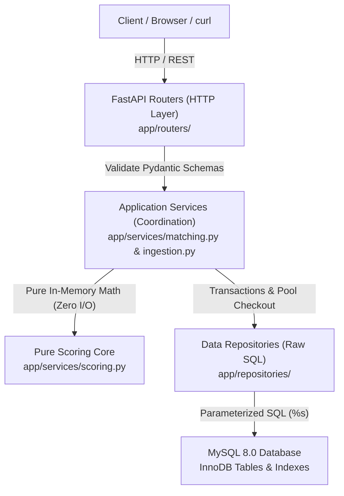
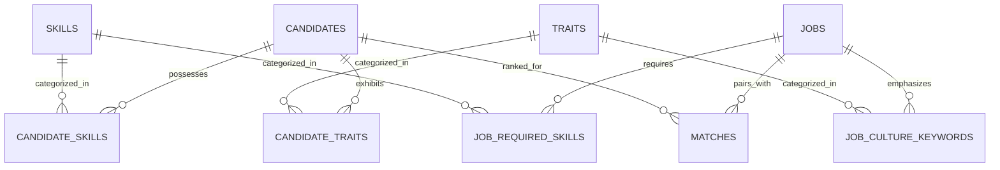

# Recruiter Bot & SQL Detective — Complete System & Architecture Guide

> **A comprehensive technical handbook and business overview for understanding, running, and extending the Recruiter Bot project.**

---

## 1. Executive Summary

### The Business Problem
Traditional recruitment software suffers from two critical flaws:
1. **Black-box AI opacity**: Unexplainable machine-learning matchers rank candidates without clear reasons, exposing hiring teams to unconscious bias and regulatory compliance risks.
2. **Computational inefficiency**: Calculating compatibility across thousands of candidates and jobs on every page refresh requires $O(C \times J)$ comparisons, leading to slow dashboard load times.

### The Solution: Recruiter Bot
**Recruiter Bot** is an explainable candidate-job matching service built with **Python (3.11+)**, **FastAPI**, and **MySQL 8.0**. 

* **Deterministic & Explainable**: Matches are generated using a mathematical scoring formula with explicit weights across 4 dimensions: **Skills (55%)**, **Experience (20%)**, **Culture (10%)**, and **Availability (15%)**.
* **Pre-Computed Persisted Matches**: Matches are materialized in MySQL upon candidate/job creation or bulk ingestion. Querying candidates for a job is an instant $O(1)$ indexed lookup.
* **Zero ORM / Pure SQL**: Every database interaction is executed using hand-crafted, parameter-bound SQL statements (`%s`), ensuring optimal query execution plans and zero SQL injection vulnerability.

---

## 2. System Architecture & Engineering Principles

The application adheres to a strict **layered clean architecture** with separation of concerns:



### Key Technical Decisions

| Decision | Implementation | Why it was chosen |
| :--- | :--- | :--- |
| **Zero ORM / Query Builders** | Hand-written SQL via `mysql-connector-python` | ORMs introduce memory overhead, hidden N+1 queries, and opaque SQL. Raw SQL ensures 100% predictable execution plans and tight index utilization. |
| **Sync Endpoints (`def`)** | Sync route handlers instead of `async def` | The official MySQL driver performs blocking socket I/O. If called inside `async def`, it would block FastAPI's single asyncio event loop thread. By defining routes as standard `def`, FastAPI offloads each request to an external worker threadpool (`anyio.to_thread.run_sync`). |
| **Pure Scoring Core** | `calculate_match_score()` has 0 database calls and 0 network I/O | The domain scoring logic takes pure dataclasses/frozen sets and returns a score + explanation string. This enables ultra-fast in-memory unit tests that execute in milliseconds without database fixtures. |
| **Strict Type Safety** | 100% type annotations passing `mypy --strict` | Prevents runtime `NoneType` and type coercion errors across all service boundaries. |

---

## 3. Database Schema & Data Modeling

The schema is partitioned into normalized entities, relational junction tables, and a persisted match ledger:



### Table Structure Breakdown

1. **`candidates`**: Stores applicant personal information (`full_name`, `experience_years`, `availability`, `quirk`).
   - `availability` is constrained by an `ENUM('immediate', 'two_weeks', 'not_looking')`.
   - `experience_years` has a `CHECK (experience_years >= 0)` constraint.
2. **`jobs`**: Stores job postings (`title`, `min_experience_years`, `tagline`).
3. **`skills` & `traits`**: Unique dictionaries of verified skills (e.g. `Python`, `SQL`, `Docker`) and workplace traits (e.g. `Analytical`, `Autonomous`).
4. **Junction Tables**: `candidate_skills`, `candidate_traits`, `job_required_skills`, and `job_culture_keywords` map relationships with `ON DELETE CASCADE`.
5. **`matches` (Persisted Match Ledger)**:
   - Stores pre-computed matching calculations between a `(job_id, candidate_id)`.
   - Compound primary key: `PRIMARY KEY (job_id, candidate_id)`.
   - **Crucial Compound Indexes**:
     - `KEY ix_matches_job_rank (job_id, score DESC, candidate_id)`: Enables instant sorted retrieval of top candidates for any job without MySQL filesort operations.
     - `KEY ix_matches_candidate_rank (candidate_id, score DESC, job_id)`: Enables instant sorted retrieval of top jobs for any candidate.
   - Stores sub-scores (`skill_score`, `experience_score`, `culture_score`, `availability_score`), JSON arrays of `matched_skills` and `missing_skills`, and the human-readable `reason` text.

---

## 4. The Mathematical Scoring Engine

The scoring core calculates a deterministic score from **0.0 to 100.0** based on four weighted dimensions:

$$\text{Final Score} = 100 \times \left( 0.55 \cdot S + 0.20 \cdot E + 0.10 \cdot C + 0.15 \cdot A \right)$$

### 1. Skills Overlap ($S \in [0.0, 1.0]$, Weight = 55%)
Evaluates the proportion of the job's mandatory skills possessed by the candidate:
$$S = \frac{|\text{Candidate Skills} \cap \text{Job Required Skills}|}{|\text{Job Required Skills}|}$$
*(If a job requires no specific skills, $S = 1.0$.)*

### 2. Experience Fit ($E \in [0.0, 1.0]$, Weight = 20%)
Calculated as the ratio of candidate experience to minimum required experience, capped at 1.0:
$$E = \min\left(1.0, \frac{\text{Candidate Experience}}{\text{Job Min Experience}}\right)$$
*(If the job requires 0 years minimum, $E = 1.0$. Candidates who exceed the required experience receive the full 1.0 without artificial penalties).*

### 3. Culture & Trait Alignment ($C \in [0.0, 1.0]$, Weight = 10%)
Evaluates the intersection between the candidate's personal traits and the role's culture keywords:
$$C = \frac{|\text{Candidate Traits} \cap \text{Job Culture Keywords}|}{|\text{Job Culture Keywords}|}$$
*(If no culture keywords are specified, $C = 1.0$.)*

### 4. Availability Penalty ($A \in [0.0, 1.0]$, Weight = 15%)
Applies a step-function discount based on how quickly the candidate can start:
* **Immediate**: $A = 1.00$ (Full points)
* **Two Weeks Notice**: $A = 0.80$
* **Not Looking / Long Notice**: $A = 0.00$

### 5. Deterministic Tie-Breaking
When two candidates achieve identical match scores, ordering is strictly deterministic:
1. `score DESC` (Primary)
2. `skill_score DESC` (Prioritize technical proficiency)
3. `availability_score DESC` (Prioritize rapid onboarding)
4. `candidate_id ASC` (Stable chronological tie-breaker)

---

## 5. API Reference & Usage Guide

The service exposes a clean REST API documented interactively via OpenAPI / Swagger.

| Method | Endpoint | Description |
| :--- | :--- | :--- |
| `GET` | `/docs` | Interactive Swagger UI for testing endpoints in the browser |
| `GET` | `/health` | Healthcheck verifying API liveness and MySQL connection pool readiness |
| `POST` | `/ingest` | Bulk-ingests candidates and jobs from a JSON document and triggers recomputation |
| `GET` | `/jobs` | Lists all active job postings |
| `POST` | `/jobs` | Creates a new job posting |
| `GET` | `/jobs/{id}/matches` | Returns ranked candidate matches for a job with full score breakdowns |
| `GET` | `/candidates` | Lists candidate profiles |
| `POST` | `/candidates` | Registers a new candidate profile |
| `GET` | `/candidates/{id}/matches` | Returns ranked job opportunities suitable for a specific candidate |

### Sample Response: `GET /jobs/1/matches`
```json
{
  "job": {
    "id": 1,
    "title": "Backend Detective",
    "min_experience_years": 3.0
  },
  "total_matches": 5,
  "matches": [
    {
      "rank": 1,
      "candidate": {
        "id": 1,
        "full_name": "Sherlock H.",
        "experience_years": 8.0,
        "availability": "immediate"
      },
      "score": 95.0,
      "breakdown": {
        "skills_score": 1.0,
        "experience_score": 1.0,
        "culture_score": 0.5,
        "availability_score": 1.0
      },
      "matched_skills": ["deduction", "forensics", "pattern-recognition"],
      "missing_skills": [],
      "reason": "Matches 3/3 required skills (100%), exceeds minimum experience (8.0y vs 3.0y), available immediately."
    }
  ]
}
```

---

## 6. Part 2: The SQL Detective Challenge

Located in [sql_detective/](file:///d:/recruiter-bot/sql_detective/), this component solves a forensic hiring-operations investigation across 7 complex SQL queries:

1. **Q1 — Open Postings**: Queries open jobs joined with responsible recruiters.
2. **Q2 — Funnel Conversion to Final Stage**: Counts distinct applicants reaching the `Final` interview round using `COUNT(DISTINCT LOWER(TRIM(email)))` to handle case variations.
3. **Q3 — Cross-Application Tracking**: Detects candidates applying to multiple positions across the company.
4. **Q4 — Hiring Conversion Velocity**: Computes the conversion percentage from initial application to signed offer.
5. **Q5 — Recruiter Load Balancing**: Evaluates active pipeline volume per recruiter.
6. **Q6 — Bottleneck Identification**: Pinpoints interview stages with highest drop-off and rejection rates.
7. **Q7 — Data Anomaly Detection**: Uncovers duplicate applicant entries, case mismatches, and orphan records without application headers.

---

## 7. Developer Runbook & Local Execution

### Environment Setup
All database and runtime parameters are managed through [.env](file:///d:/recruiter-bot/.env):
```env
DB_HOST=localhost
DB_PORT=3306
DB_USER=root
DB_PASSWORD=jeevan
DB_NAME=recruiter_bot
DB_POOL_SIZE=5

MIN_SCORE_DEFAULT=20.0
LOG_LEVEL=INFO
```

### Running Locally (Without Docker)

```powershell
# 1. Activate Virtual Environment
.venv\Scripts\activate

# 2. Run Database Migrations and Seed Data
python -m app.seed

# 3. Start Development Server with Live Reload
uvicorn app.main:app --reload --host 127.0.0.1 --port 8000
```

### Running Automated Test Gates

```powershell
# Run all unit and integration tests
pytest

# Static type verification
mypy app

# Code style and lint check
ruff check app
```
