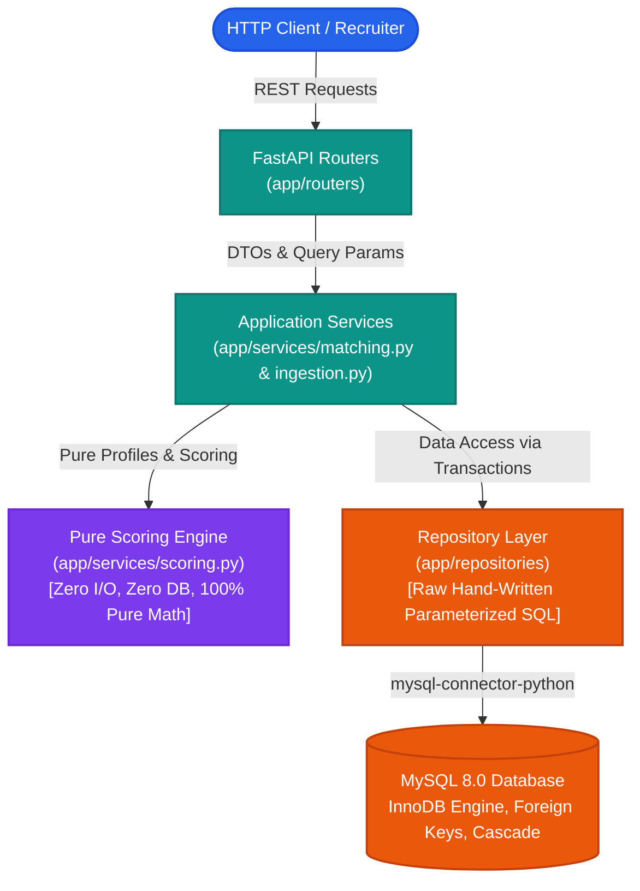

# 🎯 Recruiter Bot & SQL Detective

[](https://www.python.org/)
[](https://fastapi.tiangolo.com/)
[](https://www.mysql.com/)
[](#4-design-decisions-and-trade-offs)
[](#7-automated-tests--code-quality)
[](#7-automated-tests--code-quality)
[](#7-automated-tests--code-quality)
[](#option-a-docker-compose-one-command)

> An explainable candidate-job matching service and analytical SQL challenge built for the **RecruiterFlow Engineering Take-Home Assignment**. Powered by **Python 3.11**, **FastAPI**, **hand-written parameterized SQL**, and **MySQL 8**.

---

## 📑 Table of Contents

1. [Overview](#1-overview)
2. [System Architecture](#system-architecture)
3. [How to Install and Run Locally](#2-how-to-install-and-run-locally)
   - [Option A: Docker Compose (One Command)](#option-a-docker-compose-one-command)
   - [Option B: Local Host Setup (Python + MySQL)](#option-b-local-host-setup-python--mysql)
4. [API Examples with cURL](#3-api-examples-with-curl)
5. [Design Decisions and Trade-offs](#4-design-decisions-and-trade-offs)
6. [Part 2: SQL Detective Challenge](#5-part-2-sql-detective)
7. [Automated Tests & Code Quality](#7-automated-tests--code-quality)
8. [Use of AI Tools](#6-use-of-ai-tools)

---

## 1. Overview

Recruiter Bot is an explainable backend candidate-job matching service built with Python 3.11, FastAPI, and MySQL 8. It ranks candidate profiles against open job requisitions using deterministic, transparent scoring across skills, experience, availability, and culture fit, with zero ORM dependencies and hand-written parameterized SQL. The service persists precomputed matches for fast indexed lookups and updates them atomically upon profile changes. This repository also includes Part 2: the SQL Detective challenge featuring investigative queries for hiring operations.

---

## System Architecture

The service follows a strict **Layered Clean Architecture** where each layer maintains isolated responsibilities:



### Architectural Guarantees:
- **Zero ORM or Query Builder**: No SQLAlchemy ORM, Peewee, or query-generating abstractions. Every query is hand-written with strict `%s` parameter binding.
- **Pure Scoring Core**: The core matching math in `app/services/scoring.py` is 100% deterministic with zero database, disk, or network dependencies.
- **Sync Endpoints for Blocking MySQL Driver**: FastAPI route handlers are declared as synchronous `def` functions, allowing FastAPI to execute blocking socket I/O in an external worker threadpool rather than stalling Python's async event loop.
- **Normalized Schema**: Skills and traits are stored in dedicated lookup tables with many-to-many junction tables, preventing delimited string antipatterns.

---

## 2. How to Install and Run Locally

### Prerequisites
- **Python 3.11+**
- **MySQL 8.0+** running locally (or via Docker)

---

### Option A: Docker Compose (One Command)

The fastest and most reproducible way to run the database and the API:

```bash
# 1. Clone repository
git clone <repo-url>
cd recruiter-bot

# 2. Build and launch services in background
docker compose up --build -d

# 3. Seed database with candidates, jobs, and compute initial matches
docker compose exec app python -m app.seed
```

- **Interactive API Documentation**: Open [http://localhost:8000/docs](http://localhost:8000/docs)
- **Run automated tests inside Docker**: `docker compose exec app pytest -v`
- **Stop containers**: `docker compose down`

---

### Option B: Local Host Setup (Python + MySQL)

#### 1. Setup Virtual Environment
```bash
# Windows PowerShell
python -m venv .venv
.venv\Scripts\Activate.ps1

# Linux / macOS
python -m venv .venv
source .venv/bin/activate
```

#### 2. Install Dependencies
```bash
pip install -e ".[dev]"
```

#### 3. Configure Environment Variables
Copy `.env.example` to `.env` and set your local MySQL connection credentials:
```bash
cp .env.example .env
```
Example `.env`:
```ini
DB_HOST=localhost
DB_PORT=3306
DB_USER=root
DB_PASSWORD=your_mysql_password
DB_NAME=recruiter_bot
DB_POOL_SIZE=5
MIN_SCORE_DEFAULT=20.0
LOG_LEVEL=INFO
```

#### 4. Create the Database in MySQL
```sql
CREATE DATABASE IF NOT EXISTS recruiter_bot;
```

#### 5. Run Database Migrations and Seed Data
```bash
python -m app.seed
```
*Executes the raw DDL schema in `db/migrations/001_init.sql`, normalizes and loads all 15 candidates and 6 jobs from `data/seed.json`, and calculates initial matches atomically.*

#### 6. Start the API Server
```bash
uvicorn app.main:app --reload --host 0.0.0.0 --port 8000
```
API is live at [http://localhost:8000](http://localhost:8000) with interactive Swagger UI at [http://localhost:8000/docs](http://localhost:8000/docs).

#### 7. Run Test Suite & Quality Gates
```bash
# Run 40 automated tests
pytest -v

# Run linter
ruff check app tests

# Run strict static type checking
mypy app tests
```

---

## 3. API Examples with cURL

All API responses return uniform, strongly-typed JSON.

### 1. Ingest Seed Data
Populates candidates and jobs and computes initial match scores idempotently.
```bash
curl -X POST http://localhost:8000/ingest
```

### 2. List All Jobs
```bash
curl http://localhost:8000/jobs?limit=10&offset=0
```

### 3. Get Ranked Candidate Matches for a Job (`GET /jobs/{id}/matches`)
```bash
curl "http://localhost:8000/jobs/1/matches?limit=5&min_score=20"
```

#### Sample JSON Response:
```json
{
  "job": {
    "id": 1,
    "title": "Backend Detective",
    "min_experience_years": 3.0
  },
  "total": 2,
  "limit": 5,
  "offset": 0,
  "matches": [
    {
      "rank": 1,
      "candidate": {
        "id": 1,
        "full_name": "Sherlock H.",
        "experience_years": 8.0,
        "availability": "immediate"
      },
      "score": 95.0,
      "breakdown": {
        "skills": 1.0,
        "experience": 1.0,
        "culture": 0.5,
        "availability": 1.0
      },
      "matched_skills": [
        "deduction",
        "forensics",
        "pattern-recognition"
      ],
      "missing_skills": [],
      "reason": "Matches 3/3 required skills; 8y vs 3y minimum; available immediately; culture 1/2."
    },
    {
      "rank": 2,
      "candidate": {
        "id": 9,
        "full_name": "Sheldon C.",
        "experience_years": 9.0,
        "availability": "immediate"
      },
      "score": 53.33,
      "breakdown": {
        "skills": 0.333,
        "experience": 1.0,
        "culture": 0.0,
        "availability": 1.0
      },
      "matched_skills": [
        "pattern-recognition"
      ],
      "missing_skills": [
        "deduction",
        "forensics"
      ],
      "reason": "Matches 1/3 required skills; missing deduction, forensics; 9y vs 3y minimum; available immediately; culture 0/2."
    }
  ]
}
```

### 4. Get Ranked Job Matches for a Candidate (`GET /candidates/{id}/matches`)
```bash
curl "http://localhost:8000/candidates/1/matches?limit=5"
```

### 5. Create Candidate (Triggers Automatic Match Recomputation)
```bash
curl -X POST http://localhost:8000/candidates \
  -H "Content-Type: application/json" \
  -d '{
    "full_name": "Ada Lovelace",
    "experience_years": 10.0,
    "availability": "immediate",
    "skills": ["systems-design", "rapid-prototyping", "mathematics"],
    "traits": ["analytical", "innovative"],
    "quirk": "Wrote the first computer algorithm in history."
  }'
```

### 6. Create Job Opening (Triggers Automatic Match Recomputation)
```bash
curl -X POST http://localhost:8000/jobs \
  -H "Content-Type: application/json" \
  -d '{
    "title": "Senior Systems Architect",
    "min_experience_years": 8.0,
    "required_skills": ["systems-design", "rapid-prototyping"],
    "culture_keywords": ["innovative", "autonomous"],
    "tagline": "Design systems that withstand high concurrency."
  }'
```

---

## 4. Design Decisions and Trade-offs

### Scoring Engine Weight Distribution

$$\text{Final Score} = \text{round}\Big((0.55 \cdot S + 0.20 \cdot E + 0.10 \cdot C + 0.15 \cdot A) \times 100,\; 2\Big)$$

| Dimension | Weight | Metric / Calculation | Engineering Rationale |
| :--- | :---: | :--- | :--- |
| **Skills ($S$)** | **55%** | $\frac{\|\text{cand\_skills} \cap \text{req\_skills}\|}{\|\text{req\_skills}\|}$ | Core technical skills are the primary qualifier. Extra candidate skills are **never penalized** (recall-based overlap). |
| **Experience ($E$)** | **20%** | $\min\left(1.0, \frac{\text{candidate\_exp}}{\text{job\_min\_exp}}\right)$ | Scaled proportionally if under-qualified; **capped at 1.0** for over-qualified. Overqualification is intentionally not penalized. |
| **Availability ($A$)** | **15%** | `immediate` = 1.0<br>`two_weeks` = 0.8<br>`not_looking` = 0.0 | Active seekers are boosted for urgent requisition placement. Passive talent (`not_looking`) receives 0 but remains indexed and searchable. |
| **Culture ($C$)** | **10%** | Exact match + alias map / total keywords | Low weight prevents subjective cultural traits from overriding technical competence. |

### Key Architectural Choices

1. **Hard Gate on Zero Skill Overlap**:
   If a candidate shares zero required skills with a job, **no match row is created**. Without this gate, candidates with zero relevant skills could score 35–45 points purely from high experience and immediate availability, creating noise in recruiter pipelines.

2. **Precomputed & Persisted `matches` Table vs. Compute-on-Read**:
   - **Advantage**: Fast indexed lookups. `GET /jobs/{id}/matches` queries an indexed B-tree (`ORDER BY score DESC, skill_score DESC, availability_score DESC, candidate_id ASC`) with pagination, avoiding expensive Cartesian joins on every HTTP request.
   - **Trade-off & Mitigation**: Stored matches can become stale when candidate profiles or job openings change. To prevent staleness, every write (`POST /candidates`, `POST /jobs`, `POST /ingest`) automatically recomputes and synchronizes affected matches within the same transaction. A manual recompute endpoint (`POST /matches/recompute`) is also provided.

3. **Deterministic Tie-Breaking**:
   Sorting strictly follows `score DESC, skill_score DESC, availability_score DESC, candidate_id ASC` (or `job_id ASC`), ensuring stable, predictable pagination across requests.

4. **Synchronous Endpoint Handlers (`def` vs `async def`)**:
   `mysql-connector-python` is a synchronous, blocking network driver. Using synchronous `def` handlers ensures FastAPI automatically offloads blocking database calls to an external threadpool, preventing Python's single-threaded async event loop from freezing.

5. **Known Limitations**:
   - Trait matching uses normalized exact strings and a documented alias map (`calm-under-pressure` $\to$ `calm`) rather than heavy NLP or embedding models.
   - Skills are evaluated as binary presence rather than proficiency depth or recency.
   - Scoring weights are heuristic domain rules rather than trained on historical hiring funnel conversions.

---

## 5. Part 2: SQL Detective

Part 2 is located in a single, self-contained file at the repository root: [`sql_detective.sql`](sql_detective.sql).

### How to Run:
```bash
mysql -u root -p hiring_ops < sql_detective.sql
```
*(Creates the challenge schema, loads seed records AS-IS, and executes all 5 analytical queries).*

### Query Summary & Verified Outputs on MySQL 8:

| # | Question & Objective | Analytical Approach | Verified Output Summary |
| :-: | :--- | :--- | :--- |
| **Q1** | **Open Job Postings**<br>List all open postings with recruiter name | `JOIN job_postings jp JOIN recruiters r` filtering `status = 'open'` | Jobs 1, 2, 4, 5 with Priya Shah, Daniel Ortiz, Priya Shah, Wei Zhang. |
| **Q2** | **Final Stage Applicants per Job**<br>Count distinct applicants reaching Final stage | `LEFT JOIN interviews` & `LEFT JOIN applicants` with email normalization; shows `0` for jobs with zero | Job 1: 2, Job 2: 2, Job 3: 1, Job 4: 2, Job 5: 0, Job 6: 0, Job 7: 2. |
| **Q3** | **Multi-Posting Applicants**<br>Find people who applied to > 1 job posting | `GROUP BY LOWER(TRIM(email))` handling Ananya Rao case discrepancy; `COUNT(DISTINCT) > 1` | Ananya Rao (jobs 1, 4), Ben Turner (jobs 1, 3), Elena Popescu (jobs 2, 7). |
| **Q4** | **Recruiter Conversion Rate**<br>Finals pass rate (`passed / total`) | `HAVING COUNT(*) >= 3`, avoids integer division with `1.0 *`, rounded to 2 decimals | Priya Shah: 75.00% (3/4), Daniel Ortiz: 50.00% (2/4). Others excluded. |
| **Q5** | **Bonus: Top Recruiter per Department**<br>Most successful placements per department | Window function `RANK() OVER (PARTITION BY department ORDER BY placements DESC)` | Data: Fatima Al-Sayed (1 placement); Engineering: Priya Shah (3 placements). |

> [!NOTE]
> **Why `RANK()` instead of `ROW_NUMBER()` in Q5?**
> `RANK()` preserves ties so multiple top recruiters in a department both appear at rank 1. `ROW_NUMBER()` would arbitrarily drop one tied recruiter, which is unsuitable for fair recruitment reporting.

---

## 7. Automated Tests & Code Quality

The test suite runs with `pytest` and contains 40 tests covering pure scoring math, hard-gate validation, tie-breaking determinism, transaction rollbacks, and HTTP API integration:

```bash
# Run pytest test suite
pytest -v

# Run ruff code linter
ruff check app tests

# Run strict mypy static type checking across 28 files
mypy app tests
```

### Test Suite Coverage:
- **`tests/test_scoring.py`** (26 unit tests): Sherlock vs Backend Detective = exactly 95.0; zero-skill hard gate; experience capping at 1.0; availability scoring (`immediate` > `two_weeks` > `not_looking`); deterministic tie-breaking; culture alias resolution (`calm-under-pressure` matches `calm`).
- **`tests/test_api.py`** (11 integration tests): `GET /jobs/{id}/matches`, `GET /candidates/{id}/matches`, pagination, real `total_matches` verification, 404 error formatting, 422 validation, reactive write recomputations.
- **`tests/test_ingestion.py`** (3 ingestion tests): JSON seed structure, atomic batch loading, and transaction rollback integrity.

---

## 6. Use of AI tools

I used <tool> for <what>. I reviewed and understand all code.
