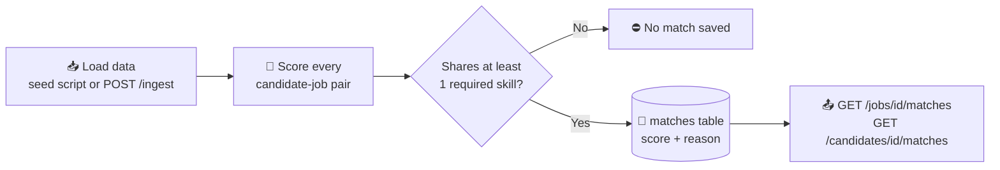
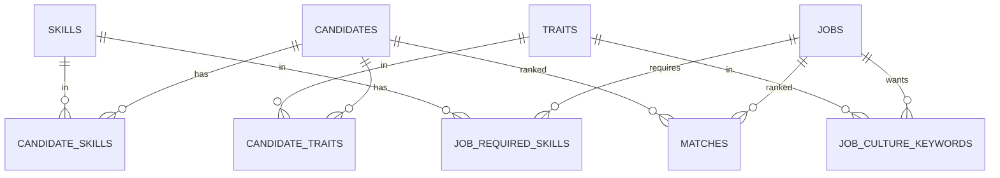

<div align="center">

# 🎯 Recruiter Bot

**Ranks the best candidates for every job, and the best jobs for every candidate, with a plain-English reason for each score.**


*RecruiterFlow Backend Developer Assignment: Part 1 (Recruiter Bot) and Part 2 (SQL Detective)*

</div>

---

## 📌 At a glance

| | |
| :-- | :-- |
| **What it is** | A backend API that matches candidates to jobs and explains every match |
| **Stack** | Python 3.11, FastAPI, MySQL 8, `mysql-connector-python` |
| **Database access** | 100% hand-written, parameterized SQL (no ORM, no query builder) |
| **Seed data** | 15 candidates and 6 jobs from the assignment (31 matches after the skill gate) |
| **Part 2** | Five SQL questions answered in [`sql_detective.sql`](sql_detective.sql) |
| **Quality checks** | `pytest` (40 tests), `ruff`, `mypy` all pass |

> **Note:** the assignment's candidate table has 15 rows (Dwight S. is the 15th), so the seed has 15 candidates.

---

## 📖 Table of contents

1. [How it works](#-how-it-works)
2. [Quick start](#-quick-start)
3. [Try it in 60 seconds](#-try-it-in-60-seconds)
4. [The scoring formula](#-the-scoring-formula)
5. [API reference](#-api-reference)
6. [Design decisions and trade-offs](#-design-decisions-and-trade-offs)
7. [Project structure and database](#-project-structure-and-database)
8. [Tests](#-tests)
9. [Part 2: SQL Detective](#-part-2-sql-detective)
10. [Use of AI tools](#-use-of-ai-tools)

---

## 🧠 How it works

In one sentence: **the app gives every candidate-job pair a score out of 100, saves the scores, and returns them sorted from best to worst.**



1. **Load** the candidates and jobs into MySQL.
2. **Score** each pair on four things: skills, experience, culture fit and availability.
3. **Skip** pairs with no skill in common (they are not real matches).
4. **Save** the score, a breakdown and a one-line reason in the `matches` table.
5. **Serve** the ranked list. Reads are fast because the scores are already stored.

When a candidate or job is created or changed, the affected scores are recomputed in the same request, so the stored data does not go stale.

---

## 🚀 Quick start

**You need:** Python 3.11+ and MySQL 8.0+ running locally.

```bash
# 1. Get the code
git clone https://github.com/jeevanL16/recruiter-bot.git
cd recruiter-bot

# 2. Create a virtual environment
python -m venv .venv
.venv\Scripts\Activate.ps1          # Windows PowerShell
# source .venv/bin/activate         # macOS / Linux

# 3. Install
pip install -e ".[dev]"

# 4. Configure (then edit .env with your MySQL user and password)
cp .env.example .env                # Windows: copy .env.example .env
```

Create the database in MySQL:

```sql
CREATE DATABASE IF NOT EXISTS recruiter_bot;
```

Then create the tables, load the seed data and compute matches (safe to run more than once), and start the server:

```bash
python -m app.seed
uvicorn app.main:app --reload --host 127.0.0.1 --port 8000
```

Open **<http://127.0.0.1:8000/docs>** for the interactive Swagger page, where every endpoint can be tested with the **Try it out** button.

<details>
<summary><b>Environment variables</b></summary>

| Variable | Meaning | Example |
| :-- | :-- | :-- |
| `DB_HOST` | MySQL host | `localhost` |
| `DB_PORT` | MySQL port | `3306` |
| `DB_USER` | MySQL user (must exist on your server; `root` works locally) | `root` |
| `DB_PASSWORD` | MySQL password | `your_password_here` |
| `DB_NAME` | Database name | `recruiter_bot` |
| `DB_POOL_SIZE` | Connection pool size | `5` |
| `MIN_SCORE_DEFAULT` | Default minimum score filter | `20.0` |
| `LOG_LEVEL` | Log verbosity | `INFO` |
| `WEIGHT_SKILLS` | Skill overlap weight (default: 0.55) | `0.55` |
| `WEIGHT_EXPERIENCE` | Experience fit weight (default: 0.20) | `0.20` |
| `WEIGHT_CULTURE` | Culture fit weight (default: 0.10) | `0.10` |
| `WEIGHT_AVAILABILITY` | Availability weight (default: 0.15) | `0.15` |

`.env` is git-ignored. Only `.env.example` (placeholders) is committed.


</details>

<details>
<summary><b>Optional: run with Docker Compose</b></summary>

```bash
docker compose up --build -d
docker compose exec app python -m app.seed
```

API at <http://localhost:8000/docs>. Stop with `docker compose down`.

</details>

---

## ⚡ Try it in 60 seconds

On Windows PowerShell use `curl.exe` instead of `curl`, and keep the quotes around URLs.

**1. Who is the best fit for the "Backend Detective" job?**

```bash
curl "http://127.0.0.1:8000/jobs/1/matches"
```

<details open>
<summary><b>Example response</b> (Sherlock ranks first with 95)</summary>

```json
{
  "job": { "id": 1, "title": "Backend Detective", "min_experience_years": 3.0 },
  "total": 2,
  "limit": 10,
  "offset": 0,
  "matches": [
    {
      "rank": 1,
      "candidate": { "id": 1, "full_name": "Sherlock H.", "experience_years": 8.0, "availability": "immediate" },
      "score": 95.0,
      "breakdown": { "skills": 1.0, "experience": 1.0, "culture": 0.5, "availability": 1.0 },
      "matched_skills": ["deduction", "forensics", "pattern-recognition"],
      "missing_skills": [],
      "reason": "Matches 3/3 required skills; 8y vs 3y minimum; available immediately; culture 1/2."
    },
    {
      "rank": 2,
      "candidate": { "id": 9, "full_name": "Sheldon C.", "experience_years": 9.0, "availability": "immediate" },
      "score": 53.33,
      "breakdown": { "skills": 0.333, "experience": 1.0, "culture": 0.0, "availability": 1.0 },
      "matched_skills": ["pattern-recognition"],
      "missing_skills": ["deduction", "forensics"],
      "reason": "Matches 1/3 required skills; missing deduction, forensics; 9y vs 3y minimum; available immediately; culture 0/2."
    }
  ]
}
```

Only two people appear because only Sherlock and Sheldon share at least one required skill with this job.

</details>

**2. Which jobs suit Sherlock?** (the reverse direction)

```bash
curl "http://127.0.0.1:8000/candidates/1/matches"
```

**3. What happens with an id that does not exist?** (a clean 404)

```bash
curl -i "http://127.0.0.1:8000/jobs/999/matches"
```

**4. Add a new candidate.** Matches are computed in the same request.

```bash
curl -X POST http://127.0.0.1:8000/candidates \
  -H "Content-Type: application/json" \
  -d '{
    "full_name": "Ada Lovelace",
    "experience_years": 10,
    "availability": "immediate",
    "skills": ["systems-design", "rapid-prototyping", "mathematics"],
    "traits": ["analytical", "innovative"],
    "quirk": "Wrote the first algorithm in history."
  }'
```

`availability` must be `immediate`, `two_weeks` or `not_looking`. On PowerShell, save the JSON in `candidate.json` and send it with `--data "@candidate.json"`.

Then check job 2 again: Ada now appears in the ranking without any manual recompute.

---

## 🧮 The scoring formula

Every candidate-job pair gets four sub-scores between 0 and 1, combined with fixed weights:

```
score = 100 × ( 0.55 × skills  +  0.20 × experience  +  0.10 × culture  +  0.15 × availability )
```

| Dimension | Weight | Visual | How it is calculated |
| :-- | :-: | :-- | :-- |
| **Skills** | 55% | `███████████` | Required skills the candidate has ÷ required skills. Extra skills are never penalized. |
| **Experience** | 20% | `████` | `min(1, candidate years ÷ job minimum)`. Overqualified still gets 1.0. |
| **Availability** | 15% | `███` | `immediate` = 1.0, `two_weeks` = 0.8, `not_looking` = 0.0 |
| **Culture** | 10% | `██` | Job culture keywords found in the candidate's traits ÷ keywords. |

**Two rules around the formula**

- ⛔ **Skill gate:** zero shared required skills means no match is created.
- ⚖️ **Tie-breaking:** `score` ↓, then `skills` ↓, then `availability` ↓, then `id` ↑. This keeps ordering and pagination stable.

### Worked example: Sherlock H. for Backend Detective

| Check | Result | Weight | Points |
| :-- | :-- | :-: | :-: |
| Skills: has deduction, pattern-recognition and forensics | 3/3 = 1.0 | 55 | **55** |
| Experience: 8 years vs 3 required | 1.0 | 20 | **20** |
| Culture: analytical matches, autonomous does not | 1/2 = 0.5 | 10 | **5** |
| Availability: immediate | 1.0 | 15 | **15** |
| | | **Total** | **95** |

### Seed results

The seed produces **31 matches**:

| Job | Matches |
| :-- | :-: |
| Backend Detective | 2 |
| Rapid Prototyping Engineer | 3 |
| Developer Relations Lead | 6 |
| Engineering Manager, Chaos Team | 6 |
| Incident Commander | 5 |
| Sales Engineer | 9 |

---

## 🔌 API reference

Interactive docs: `/docs` (Swagger UI).

| Method | Endpoint | What it does |
| :-: | :-- | :-- |
| `GET` | `/health` | App and database health check |
| `POST` | `/ingest` | Load candidates and jobs (default `data/seed.json`) and compute matches |
| `POST` | `/matches/recompute` | Recompute all matches |
| `GET` | `/jobs` · `/jobs/{id}` | List jobs · get one job |
| `POST` | `/jobs` | Create a job and compute its matches |
| `GET` | `/candidates` · `/candidates/{id}` | List candidates · get one candidate |
| `POST` | `/candidates` | Create a candidate and compute their matches |
| `GET` | **`/jobs/{id}/matches`** | **Ranked candidates for a job** |
| `GET` | **`/candidates/{id}/matches`** | **Ranked jobs for a candidate** |

**Query parameters on both match endpoints:** `limit` (1-100, default 10), `offset` (default 0), `min_score` (0-100). `total` in the response is the full count before paging.

**Errors:** unknown ids return `404` with a JSON message; invalid input returns `422`.

<details>
<summary><b>Create a job (curl)</b></summary>

```bash
curl -X POST http://127.0.0.1:8000/jobs \
  -H "Content-Type: application/json" \
  -d '{
    "title": "Senior Systems Architect",
    "min_experience_years": 8,
    "required_skills": ["systems-design", "rapid-prototyping"],
    "culture_keywords": ["innovative", "autonomous"],
    "tagline": "Design systems that withstand high concurrency."
  }'
```

</details>

---

## ⚖️ Design decisions and trade-offs

| Decision | Why I chose it | Trade-off |
| :-- | :-- | :-- |
| **Weights 55 / 20 / 10 / 15** | Skills decide whether someone can do the job. Experience is the second factor the assignment names. Culture and availability separate similar candidates but should not outweigh ability. | Weights are my judgment, not learned from hiring outcomes. With real placement data I would fit them. |
| **Skill gate (zero overlap, no match)** | Without it, someone with no relevant skills still scored about 35 from experience and availability (for example Rick S. for Backend Detective). | A candidate with only adjacent skills is hidden. |
| **Overqualified is not penalized** | Experience is capped at 1.0. Penalizing seniority needs knowledge of what the team wants, and I did not want to invent it. | A 20-year candidate ranks like someone who just meets the minimum. |
| **`not_looking` stays in the list** | A recruiter may still want to approach a strong passive candidate. They only lose the 15 availability points. | They can still rank above weaker active candidates. |
| **Matches precomputed and stored** | Reads are an indexed lookup instead of scoring every pair per request. | Stored scores can go stale. Every write recomputes affected matches in one transaction, and `POST /matches/recompute` rebuilds everything after a weight change. |
| **Raw SQL only** | Required by the assignment. Queries are parameterized (`%s`) and the schema is hand-written DDL in `db/migrations/001_init.sql`. | More verbose than an ORM. |
| **Pure scoring function** | `app/services/scoring.py` does no I/O, so it is unit tested without a database. | None significant. |
| **Sync endpoints (`def`)** | The MySQL driver is blocking. Plain `def` lets FastAPI run it in a worker threadpool instead of blocking the event loop. | Fewer concurrent connections than a fully async stack. |
| **Input normalization** | Skills and traits are stripped and lowercased on ingestion, so messy input cannot create duplicates. | None significant. |

### Known limitations

- Skills and traits are matched as **exact strings**. The only flexibility is a small alias map (`calm-under-pressure` matches the trait `calm`). There is no fuzzy or semantic matching.
- Skills are present or absent, with no proficiency level or recency.
- Recomputing on write is simple and correct at this scale. At a much larger scale it should move to a background job.

---

## 🗂️ Project structure and database

```
recruiter-bot/
├── app/
│   ├── main.py             FastAPI app, startup, error handling
│   ├── db.py               MySQL connection pool and transactions
│   ├── seed.py             Runs the migration and loads data/seed.json
│   ├── routers/            HTTP endpoints
│   ├── services/
│   │   ├── scoring.py      Pure scoring logic (no I/O)
│   │   ├── matching.py     Computes and stores matches
│   │   └── ingestion.py    Loads candidates and jobs
│   └── repositories/       Hand-written SQL
├── db/migrations/          001_init.sql (the schema)
├── data/seed.json          The assignment's candidates and jobs
├── tests/                  pytest tests
└── sql_detective.sql       Part 2
```



- **`matches`** has primary key `(job_id, candidate_id)` and stores the total score, the four sub-scores, matched and missing skills, and the reason.
- Two ranking indexes, `(job_id, score DESC, candidate_id)` and `(candidate_id, score DESC, job_id)`, let both match endpoints read rows already in order.
- Junction tables use `ON DELETE CASCADE`.

---

## ✅ Tests

```bash
pytest -v                  # 40 tests
ruff check app tests       # lint
mypy app tests             # type check
```

| File | Covers |
| :-- | :-- |
| `tests/test_scoring.py` | Sherlock vs Backend Detective = 95.0, skill gate, experience cap, availability order, tie-breaking, `calm` alias |
| `tests/test_api.py` | Both match endpoints, pagination, `total`, 404 and 422, recompute on write |
| `tests/test_ingestion.py` | Seed loading and transaction rollback |

---

## 🕵️ Part 2: SQL Detective

All answers are in **[`sql_detective.sql`](sql_detective.sql)**. It creates the challenge tables and loads the seed data as given (not redesigned), then runs one query per question, each preceded by a `-- Q#` comment.

```bash
mysql -u <your_user> -p hiring_ops < sql_detective.sql
```

*(Create the `hiring_ops` database first if needed.)*

| # | Question | Technique | Result |
| :-: | :-- | :-- | :-- |
| **Q1** | Open postings with recruiter name | `JOIN`, `status = 'open'` | Jobs 1, 2, 4, 5 |
| **Q2** | Applicants who reached Final, per posting | `LEFT JOIN` so zero-count postings still show; distinct by lowercased email | 2, 2, 1, 2, 0, 0, 2 for jobs 1 to 7 |
| **Q3** | People who applied to more than one posting | Group by `LOWER(TRIM(email))`, `COUNT(DISTINCT job_posting_id) > 1` | Ananya Rao, Ben Turner, Elena Popescu |
| **Q4** | Final-stage conversion per recruiter (min. 3 Finals) | `HAVING COUNT(*) >= 3`, `1.0 *` to avoid integer division | Priya Shah 75.00%, Daniel Ortiz 50.00% |
| **Q5** | Bonus: top recruiter per department | `RANK() OVER (PARTITION BY department ORDER BY placements DESC)` | Engineering: Priya Shah (3), Data: Fatima Al-Sayed (1) |

- **Schema note:** there is no `applications` table in the given dataset, so "applied to a posting" is inferred from records in the `interviews` table.
- **Q3:** applicants 1 and 2 are the same person (Ananya Rao) with emails that differ only by capitalization. Grouping by raw email or applicant id would miss her.
- **Q5:** `RANK()` keeps ties, so two recruiters tied for first both appear. `ROW_NUMBER()` would pick one arbitrarily.


---

## 🤖 Use of AI tools

I used AI tools in two ways while working on this assignment:

- **Google Antigravity** (AI coding assistant): to build the project code, including the FastAPI app, the raw SQL repositories, the scoring logic, the tests and the `sql_detective.sql` file.
- **Claude**: to plan the approach, review the design and requirements, and write and edit the Markdown documentation.

I ran the app and the SQL queries locally, checked the outputs against the assignment data, and reviewed the code so I can explain the design and trade-offs in the follow-up conversation.