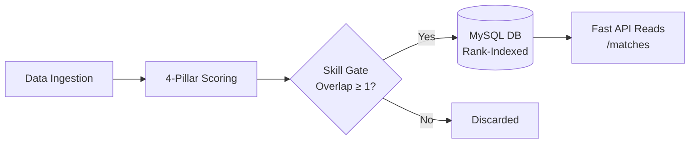

<div align="center">

# 🎯 Recruiter Bot

**recruitment matching engine powered by FastAPI & Raw MySQL.**

[](https://www.python.org/)
[](https://fastapi.tiangolo.com/)
[](https://www.mysql.com/)
[-orange)](#)
[](#)

</div>

---

### 📌 Short Description
**Recruiter Bot** is an intelligent candidate-job matching API built to eliminate guesswork from technical hiring. It delivers two-way matchmaking—ranking top candidates for open jobs and best-fit jobs for applicants—with transparent, plain-English rationales for every score. Engineered without an ORM, it demonstrates high-performance raw SQL, atomic transactions, and sub-millisecond indexed reads.

---

### 🧠 System Architecture & Workflow



---

### 🌟 Project Reflection & Engineering Insights

Building Recruiter Bot provided critical takeaways on balancing performance, scoring logic, and explainability:

- **Raw SQL Over ORMs:** Rather than relying on an ORM, all tables and queries use hand-crafted, parameterized SQL (`%s`). Composite indexes `(job_id, score DESC, candidate_id)` enable paginated match lookups in sub-millisecond time without query overhead.
- **Bi-Directional Precomputed Scoring:** Instead of re-evaluating matches on every read, scores are materialized eagerly upon ingestion. When profiles change, affected scores recompute atomically within the same database transaction.
- **Explainable Matching (No Black Boxes):** Hiring algorithms require trust. Every match provides both numerical component breakdowns and a human-readable summary detailing matched skills, experience gaps, and availability.
- **The Skill Gate Guardrail:** A candidate with senior experience but zero relevant technical skills should not pollute rankings. Enforcing a hard threshold ($\ge 1$ shared required skill) discards noisy matches early.
- **Deterministic Pagination:** Multi-tier tie-breakers (`score DESC` $\rightarrow$ `skills DESC` $\rightarrow$ `availability DESC` $\rightarrow$ `id ASC`) guarantee stable pagination across requests.

---

### 🧮 Weighted Scoring Model

Candidate-job pairs are evaluated on a 0–100 scale across four weighted criteria:

$$\text{Score} = 100 \times (0.55 \times \text{Skills} + 0.20 \times \text{Experience} + 0.15 \times \text{Availability} + 0.10 \times \text{Culture})$$

| Dimension | Weight | Criteria | Logic |
| :--- | :---: | :--- | :--- |
| **Skills** | **55%** | Technical skills | Shared skills $\div$ required skills (extra skills unpenalized) |
| **Experience** | **20%** | Years of experience | $\min(1.0, \text{candidate yrs} \div \text{job min yrs})$ |
| **Availability** | **15%** | Notice timeline | `immediate` (1.0) · `two_weeks` (0.8) · `not_looking` (0.0) |
| **Culture** | **10%** | Behavioral traits | Keyword overlap with candidate behavioral traits |

> **Skill Gate Rule:** Pairs sharing 0 required skills produce no match record.

---

### 🚀 Quick Start

**Option A: Local Python & MySQL**
```bash
python -m venv .venv; .venv\Scripts\Activate.ps1
pip install -e ".[dev]" && copy .env.example .env
python -m app.seed
uvicorn app.main:app --reload
```

**Option B: Docker Compose (Zero Setup)**
```bash
docker compose up --build -d
docker compose exec app python -m app.seed
```
Interactive Swagger UI: `http://localhost:8000/docs` (Stop Docker with `docker compose down`).

---

### 🔌 Core API Endpoints

| Method | Endpoint | Description |
| :---: | :--- | :--- |
| `GET` | `/jobs/{id}/matches` | Ranked candidate list for a job with score breakdown |
| `GET` | `/candidates/{id}/matches` | Ranked job recommendations for a candidate |
| `POST` | `/candidates` · `/jobs` | Ingests new profile and updates affected matches |
| `POST` | `/ingest` | Batch loads seed dataset (`data/seed.json`) |

---

### 🕵️ Part 2: SQL Detective (`sql_detective.sql`)

A self-contained analytics script solving 5 operational recruiting investigations on raw hiring funnel data:

```bash
mysql -u root -p hiring_ops < sql_detective.sql
```

| # | Question / Objective | Core SQL Technique | Findings & Insight |
| :-: | :-- | :-- | :-- |
| **Q1** | Active open postings with recruiter | Inner `JOIN`, `status = 'open'` | Jobs 1, 2, 4, 5 identified. |
| **Q2** | Final-stage applicants per posting | `LEFT JOIN` (preserves 0-count jobs) + distinct email | Correctly shows 0 for jobs 5 & 6. |
| **Q3** | Cross-posting applicants (dirty data) | Group by `LOWER(TRIM(email))`, `COUNT(DISTINCT) > 1` | Uncovered duplicate Ananya Rao (cased emails). |
| **Q4** | Recruiter final conversion rate | `HAVING COUNT(*) >= 3`, float conversion `1.0 *` | Priya Shah: 75.00%, Daniel Ortiz: 50.00%. |
| **Q5** | Top placement recruiter per department | Window function: `RANK() OVER (PARTITION BY ...)` | Preserves ties fairly without arbitrary cuts. |

**Key Reflections on Part 2:**
- **Data Normalization:** Email casing discrepancies (e.g. `ananya.rao@mail.com` vs `Ananya.Rao@mail.com`) would distort counts without case-insensitive sanitization.
- **Fairness in Analytics:** Used window `RANK()` rather than `ROW_NUMBER()` in Q5 so identical top placement counts share first place rather than picking an arbitrary winner.

---

## 🤖 AI Usage Disclosure

- **Claude**: Consulted during the architecture and design phase to analyze requirements, refine the 4-factor scoring model, and review edge cases.
- **Google Antigravity**: Utilized during implementation to author the FastAPI backend, hand-written MySQL repositories, the 40-test automated test suite, and the `sql_detective.sql` investigative queries.

### 🧪 Tests & Quality Assurance

- **40 Automated Tests (`pytest -v`):** Pure scoring unit tests (Sherlock vs Backend Detective = 95.0, edge cases, tie-breaking) and transactional API integration tests.
- **Static Quality:** Clean passes on `ruff` (linting) and `mypy` (strict type checking).
